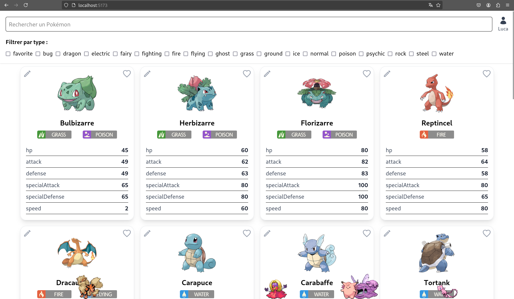

# Pokédex en React

## Description du projet

Ce projet est une application front-end développée en React permettant de consulter un Pokédex interactif. L'application se connecte à une API (développée en interne) pour récupérer les informations des Pokémon : nom, type, image, statistiques, etc.

Fonctionnalités principales :

- Liste des Pokémon avec pagination

- Fiche détaillée pour chaque Pokémon

- Recherche par nom ou filtre par type

- Système de favoris

- Les pokemons favoris agissent en tant que familliers et se baladent en bas de l'écran

- UI responsive et moderne

Ce projet met en avant l'utilisation de React avec des appels à une API REST, ainsi qu'une gestion simple de l'état et de l'affichage dynamique.



## 🛠️ Instructions d'installation

### Prérequis

- Node.js

- npm

- Accès à l'API

### Étapes d'installation

1. Cloner le dépôt :

```sh
git clone https://github.com/zkerkeb-class/pokedex-starter-lucasolerr.git
cd pokedex-starter-lucasolerr
```
2. Installer les dépendances :

```sh
npm install
```

3. Lancer l’application :

```sh
npm run dev
```

L’application sera accessible à l’adresse : `http://localhost:5173`

